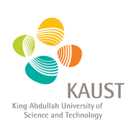

Hi! I am Yuchen Li, a 1st-year master student major in computer science at [King Abdullah University of Science and Technology (KAUST)](https://www.kaust.edu.sa/en). I'm now living in Hefei, China with my lovely family. I am working as a researcher at the Visual Computing Center at KAUST, advised by Prof. [Mohamed Elhoseiny](http://www.mohamed-elhoseiny.com/). Before joining in KAUST, I graduated from [Southern University of Science and Technology (SUSTech)](https://www.sustech.edu.cn/en/). I worked with Processor Xiaoying Tang at SUSTech and mainly focus on the research about the AI-based early diagnosis and prediction of brain disorders and eye diseases. I am proud to be an open-source contributor and I want to make friends with friends all over the world! In 2019, I finished my research project in Tsinghua University and did open source program on [Apache RocketMQ](http://rocketmq.apache.org/) as the student developer of Alibaba Summer of Code. 

## Education

<!-- ## About Me -->
<h1 id="about-me">About Me </h1>

<strong>Shaoteng Liu (刘少腾)</strong> is a 3rd-year undergraduate student major in Automation, at <a href="http://www.xjtu.edu.cn">Xi’an Jiaotong University (XJTU)</a>. He is now working as a research intern at <a href="https://bair.berkeley.edu">BAIR</a>, UC Berkeley, with <a href="https://dequan.wang">Dequan Wang</a> and Prof. <a href="https://people.eecs.berkeley.edu/~trevor/">Trevor Darrell</a>. 
Before coming to Berkeley, he worked at National University of Singapore, advised by Prof. <a href="https://www.chuatatseng.com">Chua Tat-Seng</a> and <a href="https://www.cs.cityu.edu.hk/~cwngo/">Chong-Wah Ngo</a>. 
His research interest includes Computer Vision and Machine Learning. 

<h1 id="education">Education </h1>

<b>Exchange Student (BISP)</b> 
University of California Berkeley 
Jan 2020 - May 2020

<b>Exchange Student of School of Computing</b> 
National University of Singapore 
Jan 2019 - May 2019

<b>Bachelor of Automation (Honors Engineering Program, Qian Xuesen Class)</b> 
Xi’an Jiaotong University 
Sep 2017 - Jun 2021 (Expected)

<h1 id="research-experience">Research Experience </h1>

<b>Undergraduate Intern Research</b> 
Berkeley Artificial Intelligence Research (BAIR) Lab 
Supervisor: <a href="https://dequan.wang">Dequan Wang</a> | Advisor: <a href="https://people.eecs.berkeley.edu/~trevor/">Trevor Darrell</a>

<b>Undergraduate Intern Research</b> 
National University of Singapore (School of Computing) 
Advisor: <a href="https://www.chuatatseng.com">Chua Tat-Seng</a> and <a href="https://www.cs.cityu.edu.hk/~cwngo/">Chong-Wah Ngo</a>

<h1 id="publication">Publication </h1>

<b>Fully Test-time Adaptation by Entropy Minimization.</b> 
Dequan Wang*, Evan Shelhamer*, Shaoteng Liu, Bruno Olshausen, Trevor Darrell. 
arXiv preprint arXiv:2006.10726 
<a href="https://arxiv.org/pdf/2006.10726.pdf">paper</a>

<b>Hyperbolic Visual Embedding Learning for Zero-Shot Recognition.</b> 
Shaoteng Liu, Jingjing Chen, Liangming Pan, Chong-Wah Ngo, Tat-Seng Chua, Yu-Gang Jiang. 
Computer Vision and Pattern Recognition (CVPR), 2020. 
<a href="http://openaccess.thecvf.com/content_CVPR_2020/papers/Liu_Hyperbolic_Visual_Embedding_Learning_for_Zero-Shot_Recognition_CVPR_2020_paper.pdf">paper</a>
<a href="https://github.com/ShaoTengLiu/Hyperbolic_ZSL">code</a>

<h1 id="honors-and-awards">Honors and Awards </h1>
<ul>
  <li><strong>Top 10 Undergraduate of Xi’an Jiaotong University (top 0.1% student)</strong> (This is the highest honor for undergraduates in XJTU. 10 students among 16k are awarded each year), 2019</li>
  <li><strong>National Scholarship of China (top 1% student)</strong>, 2018</li>
  <li>The First Prize of Alumni Scholarship of XJTU (top 1% student), 2018</li>
  <li>Second Prize for China Undergraduate Mathematical Contest in Modeling, 2018</li>
  <li>Third Prize for The Chinese Mathematics Competitions, 2018</li>
</ul>

